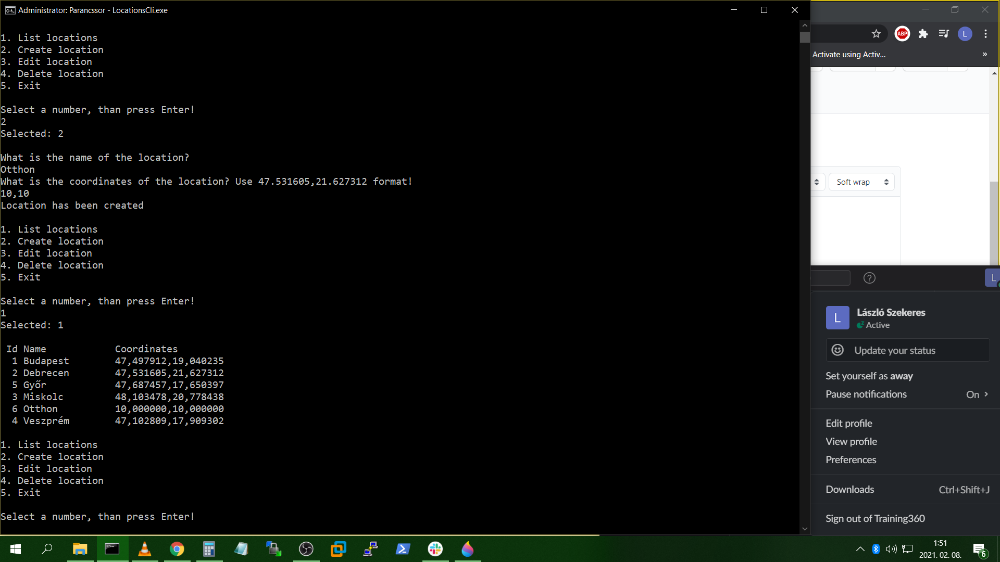
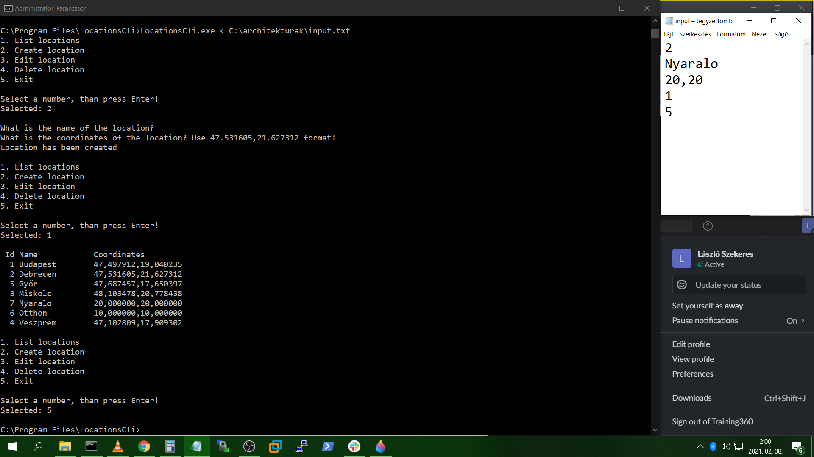
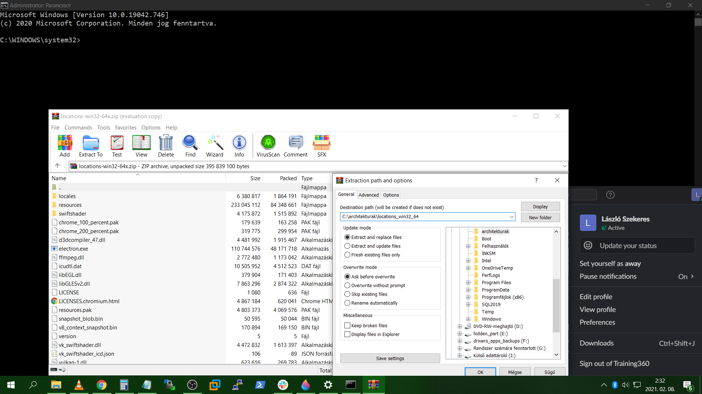
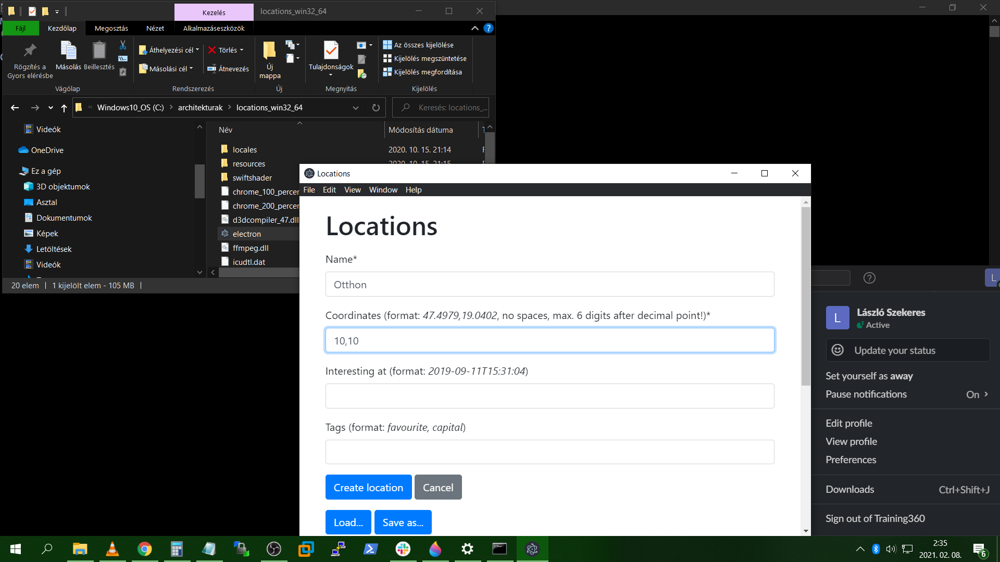
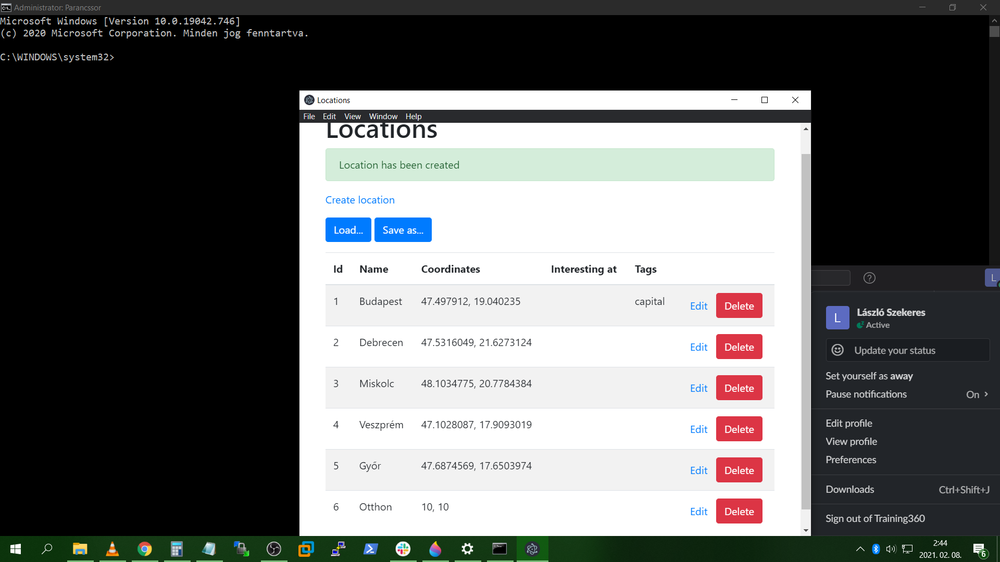
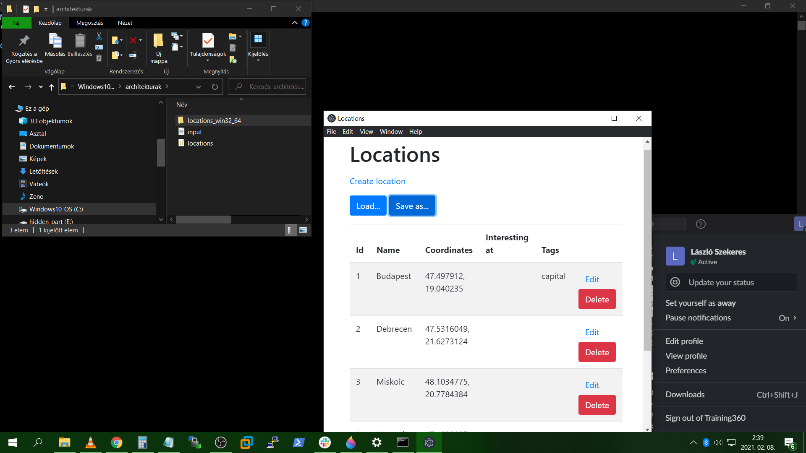
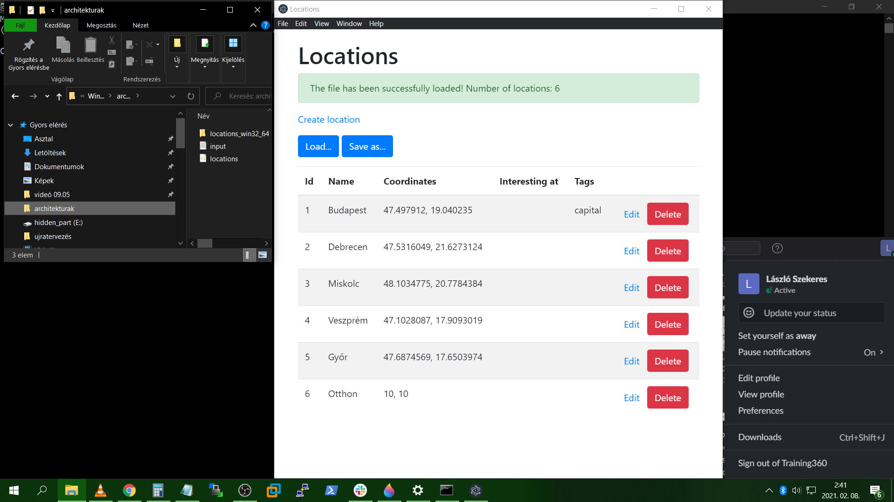

#**Tanulmányi előrehaladás ellenőrzésére létrejött repository (struktúraváltó képzés)**
______________________________________________________________________________________
  ##I. gyakorlat - Standalone konzolos alkalmazás
  
   Használat manuálisan:

   
   
   Használat szkripttel:
   
   
   
  ##II. gyakorlat - Standalone grafikus alkalmazás

   Letöltés és kicsomagolás:

   
   
   Adatbevitel:

   
   
   Ellenőrzés:

   
   
   Állapot mentése:

   
   
   Állapot visszatöltése

   
   
  ##III. gyakorlat - Központi adatbázis
