# **Tanulmányi előrehaladás ellenőrzésére létrejött repository (struktúraváltó képzés)**
______________________________________________________________________________________
  ## I. gyakorlat - Standalone konzolos alkalmazás
  
   Használat manuálisan:

   
   
   Használat szkripttel:
   
   
   
  ## II. gyakorlat - Standalone grafikus alkalmazás

   Letöltés és kicsomagolás:

   
   
   Adatbevitel:

   
   
   Ellenőrzés:

   
   
   Állapot mentése:

   
   
   Állapot visszatöltése:

   
   
  ## III. gyakorlat - Központi adatbázis
  
   Konténer letöllése és futtatása:
  
   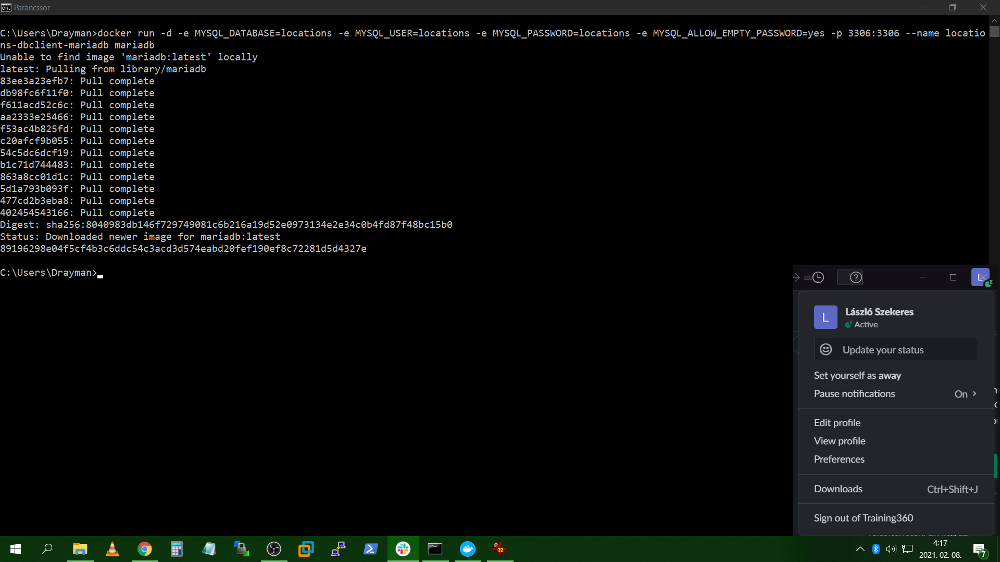
   
   Konfigurációs állomány szerkesztése:
   
   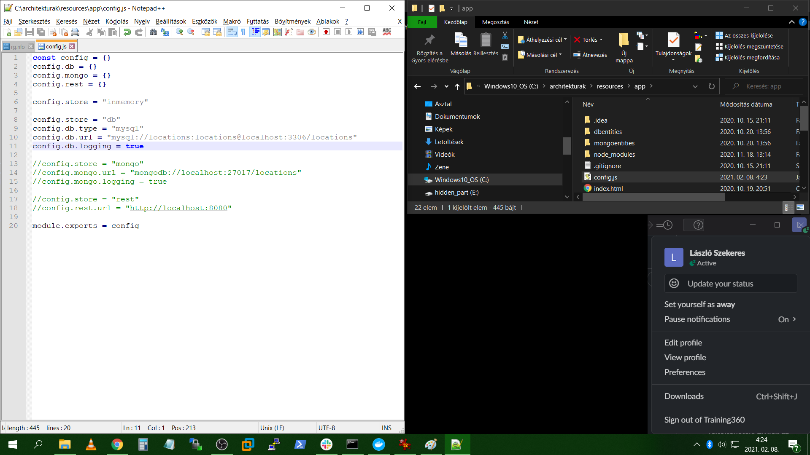
   
   Adatbevitel az adatbázisba az alkalmazáson keresztül:
   
   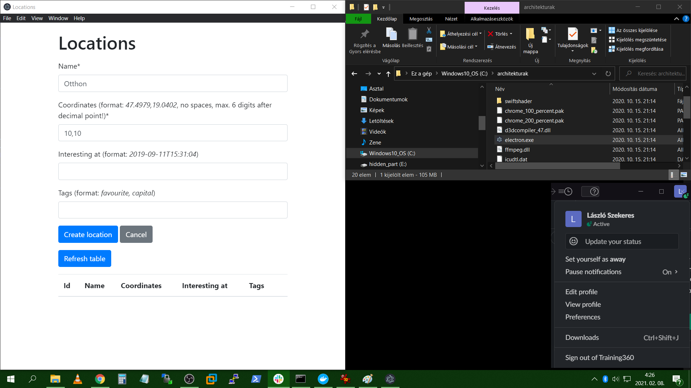
   
   A bevitt adat ellenőrzése:
   
   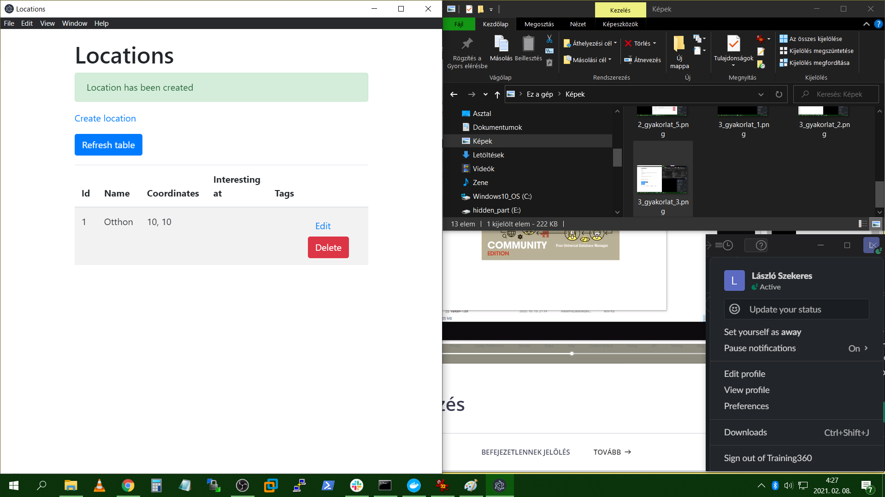
   
   DBeaver beállítása és adatbázishoz kapcsolódás:
   
   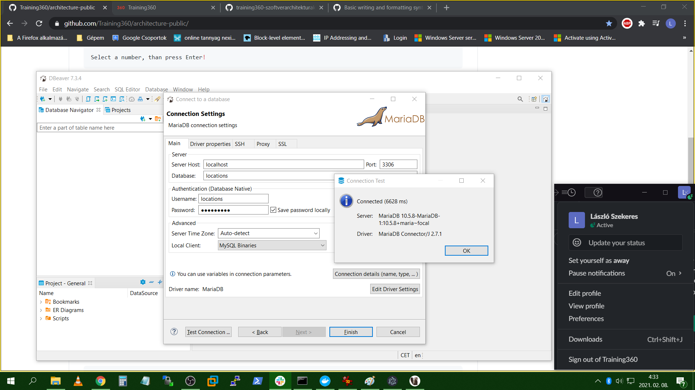
   
   Adatbevitel a DBeaver programon keresztül:
   
   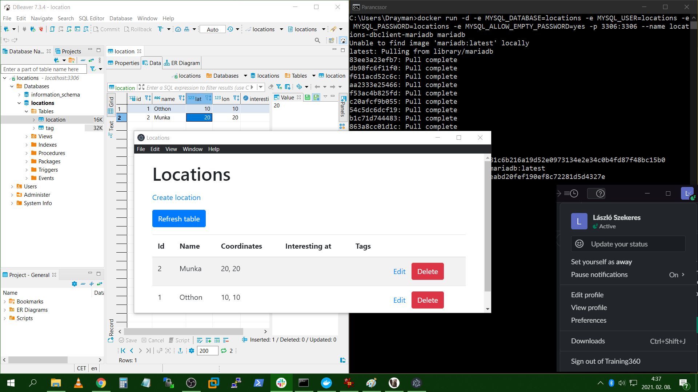
   
  ## IV. gyakorlat - SQL nyelv
  
   *desc location;* és a  *select * from location;* parancsok futása:
  
   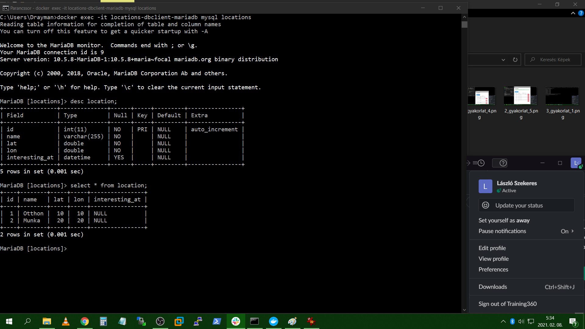
  
  *insert into location(name, lat, lon) values ('Work2', 3, 3);* parancs lefutása:
  
   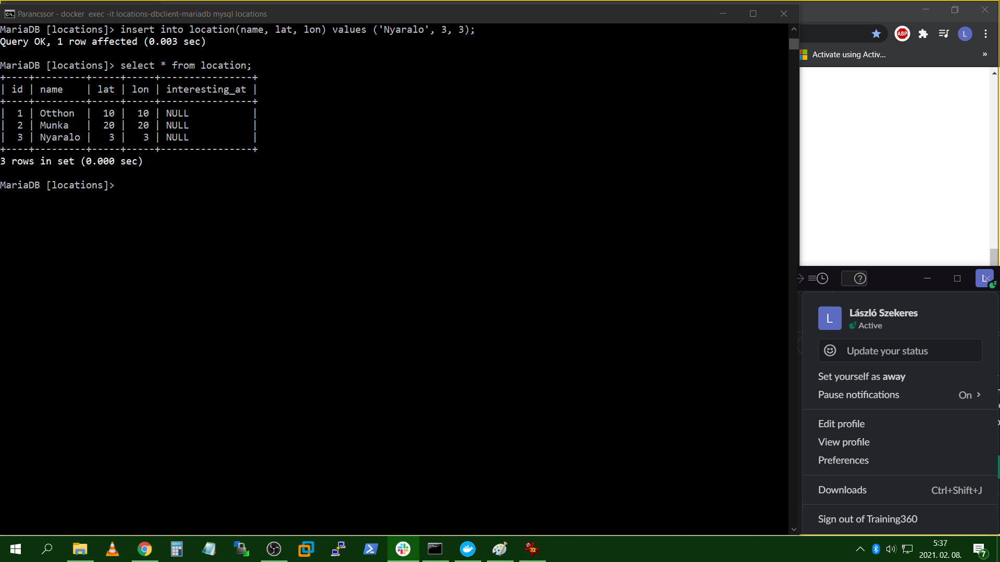
   
   *update location set name = 'Work3' where id = 3;* parancs lefutása:
   
   
   
   *delete from location where id = 3;* parancs lefutása:
   
   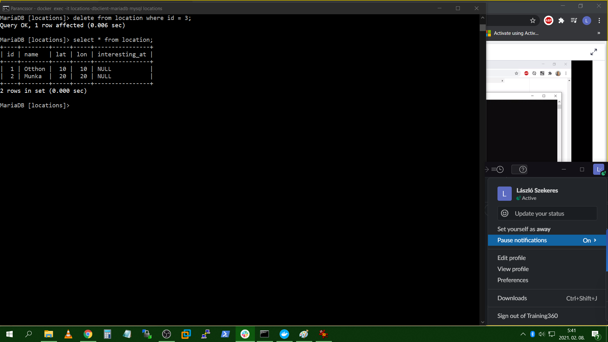
   
   Applikációba adatok felvitele és TAG-ek ellenőrzése:
   
   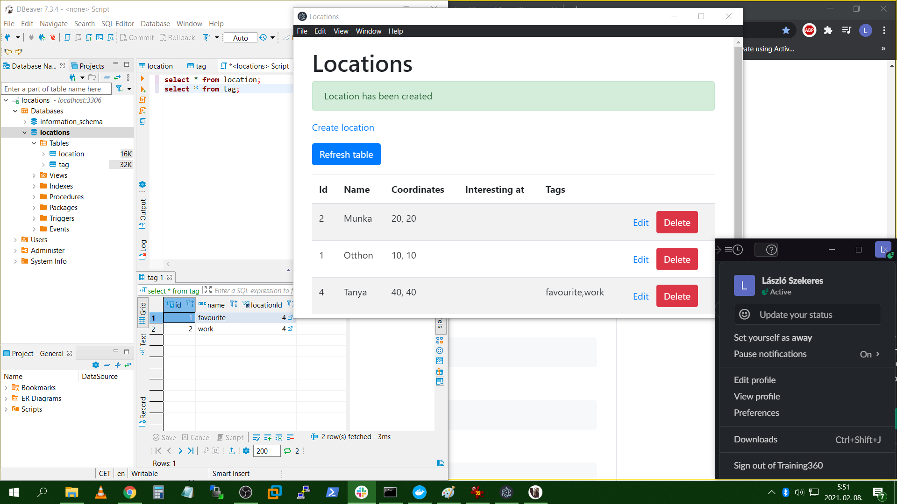
   
   Módosítás utáni állapotok:
   
   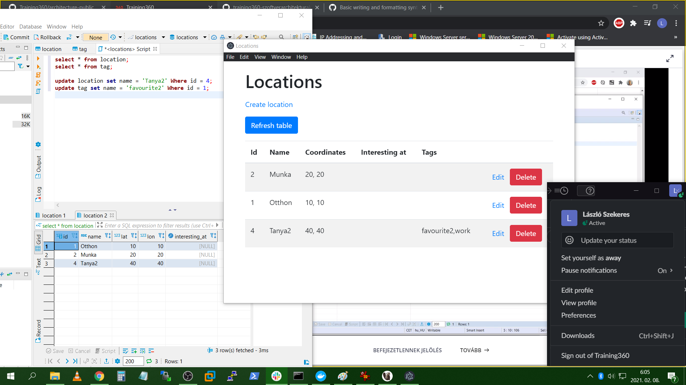
   
   ## V. gyakorlat - NOSQL adatbázisok
   
   Mongodb elindítása
   
   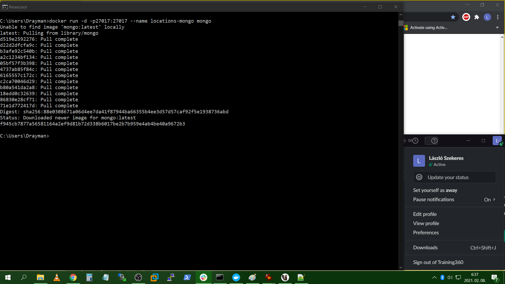
   
   Konfig fájlt szerkesztés és egy helszín hozzáadása:
   
   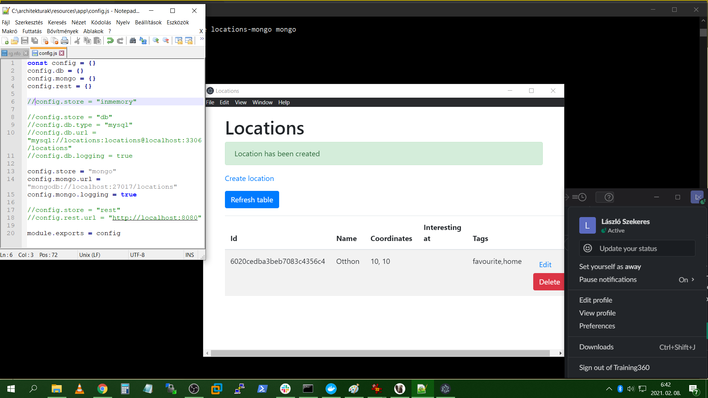
   
   *db.location.find()* és a *db.location.insert({name: "Work", lat: 2, lon: 2})* parancsok kimenete:
   
   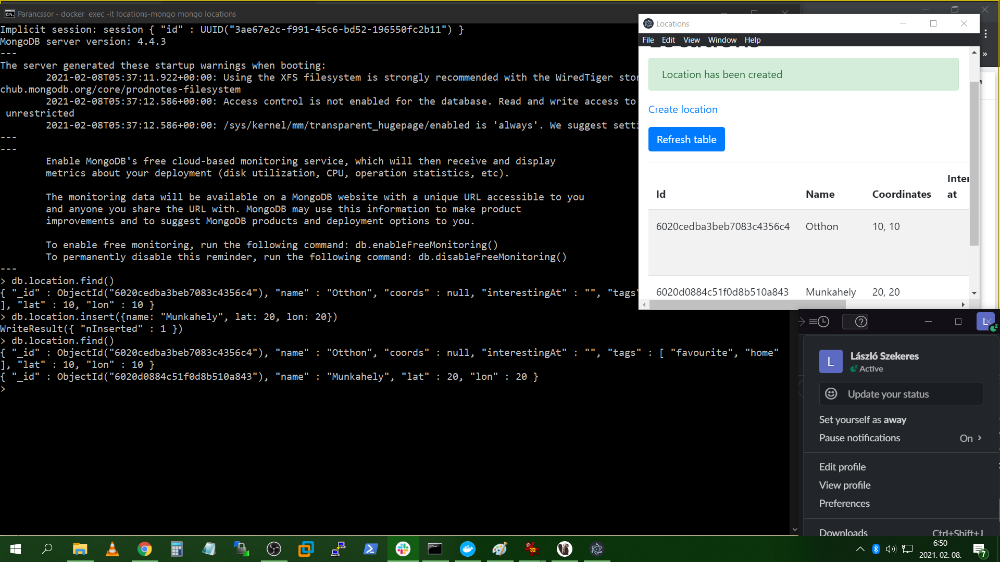
   
   Bejegyzés (dokumentum) törlése utáni állapot:
   
   
